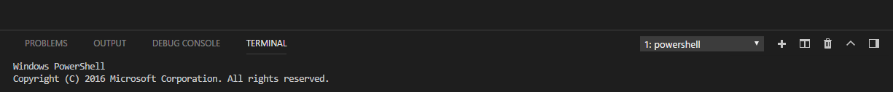
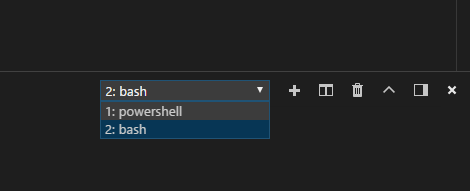

Looking up your CSE 15L account:
- You click on this [link](https://sdacs.ucsd.edu/~icc/index.php)
- You enter your username and your student ID to get your CSE 15L account
- Then follow the instructions on the screen in order to set your password (make sure it is a strong password)

Downloading Visual Studio Code:
- Click on this [link]( https://code.visualstudio.com/)
- Download for either Mac or Windows, depending on your system
- Once it is installed, you will see a screen that looks like this

Remotely Connecting:
- If you are on Windows, you must install git for [Windows](https://gitforwindows.org/)
- Then, go to Visual Studio Code and set git bash as your default terminal
  - In order to do this you must open the terminal using Ctrl + '
 
  - Press Ctrl + Shift + P to bring up the command palette
  - Then type Select Default Profile
  - Select Git Bash
  - Click the + icon in the terminal window 
  - The terminal will now be a Git Bash terminal and you should be able to toggle between different terminals as shown:
 
- Once you are in a bash terminal, type '''ssh''' cs15lsp23jj@ieng6.ucsd.edu, except the 'jj' will be replaced with the two letters
 in your course-specific account
- Enter yes to the prompt and then enter your password you set with your course-specific account
- Now your terminal is connected to a computer in the CSE basement

Running Commands:
- Try running these commands:
  - cd ~ 
  - cd
  - ls -lat
  - ls -a
  - ls <directory> where <directory> is /home/linux/ieng6/cs15lsp23/cs15lsp23abc, where the abc is one of the other group members’ username
  - cp /home/linux/ieng6/cs15lsp23/public/hello.txt ~/
  - cat /home/linux/ieng6/cs15lsp23/public/hello.txt
- These commands are helpful
- If you wish to log out, press Ctrl + D and then enter the command '''exit'''
- You are now all set up for CSE 15L
