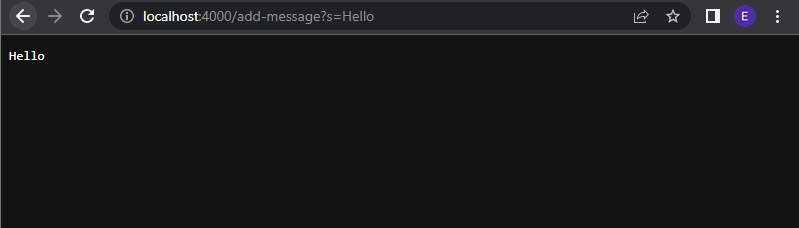
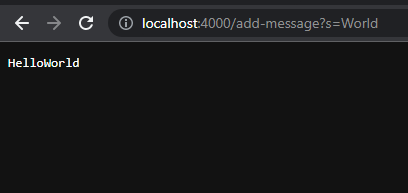

# Part 1
## Creating StringServer.java

First, you must start a web server called StringServer and in order to do that you must compile the java file.
In VSCode, you type in:
'''  
javac StringServer.java
''' 
After that you must run the java file so you type in:
'''
  java StringServer 4000
'''
The 4000 that comes after StringServer is the port number for the website. 
It can be any number between 1024 and 49151.
Next, you click on the [website](http://localhost:4000) that the output provides.

Once you have the website, you add
'''
  \add-message?s=
'''

You can type anything after the '=' and it will add to the web server you just started.

You can add "Hello" by typing 
'''
  \add-message?s=Hello
'''
at the end of the website handle. 

The result would appear like this: 

You can also change 'Hello' with any string of text. In this case, 'World':

The method being called is:
'''
  public void handle(HttpExchange exchange) throws IOException{
        URI uri = exchange.getRequestURI();
        String path = uri.getPath();
        String response = "";

        if(path.equals("/add-message")){
            String queryString = uri.getQuery();
            String[] parts = queryString.split("=");
            if(parts.length == 2 && parts[0].equals("s")){
                String newMessage = parts[1].replace("+", " ");
                message += newMessage;
                response = message;
            } else {
                response = "Invalid request!";
            }
        }else{
            response = "404 Not Found!";
        }

        exchange.sendResponseHeaders(200, response.getBytes().length);
        exchange.getResponseBody().write(response.getBytes());
        exchange.close();
    } 
'''

#Testing

# Part 2
## choosing a bug

'''

'''

# Part 3

